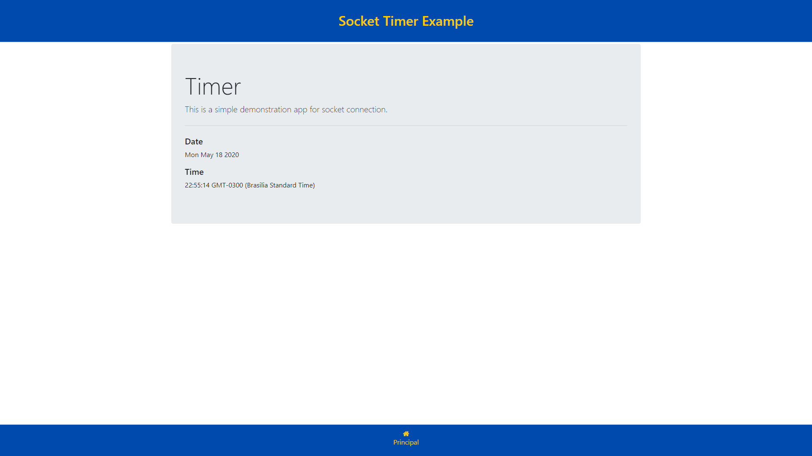
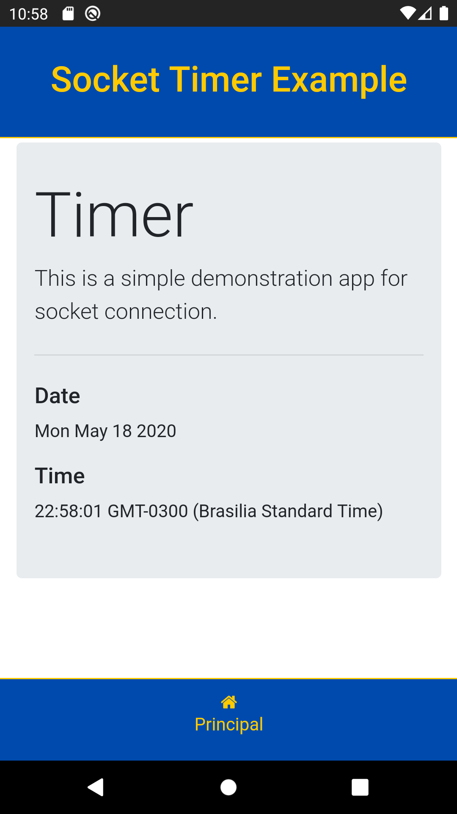
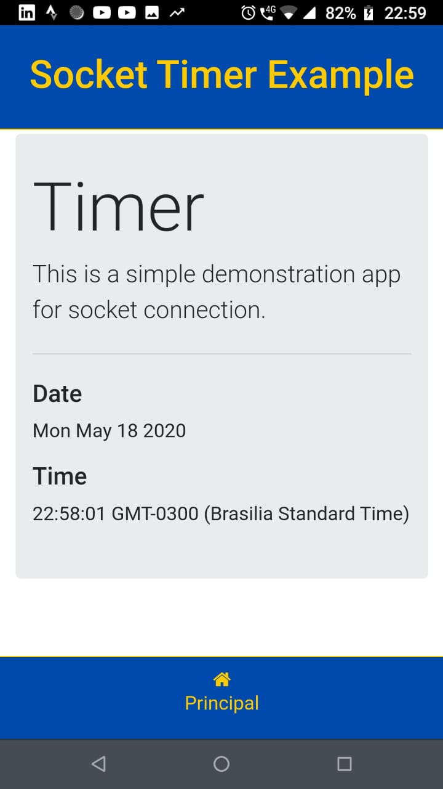

# Cordova Socket Client 

## Description
A cross platform Cordova app that shows the connection with a socket server. It updates the time every second on the screen.

## Requirements
For development, you will only need [Apache Cordova](https://cordova.apache.org/), [Node JS](https://nodejs.org/) and [NPM](https://npmjs.org/), installed in your environement. 

### Cordova

- #### Node installation on your platform

  Just go on [official Cordova setup](https://cordova.apache.org/docs/en/latest/guide/cli/index.html).

### Node and NPM

You can find more information about the installation on the [official Node.js website](https://nodejs.org/) and the [official NPM website](https://npmjs.org/).

If the installation was successful, you should be able to run the following command from your command line:

    $ node --version        

    $ npm --version
    
## Installation

### Project
    $ git clone https://github.com/brworkit/cordova-socket-client.git
    $ cd cordova-socket-client
    $ npm install (to install the required modules)
    
## Usage

Start the socket server you can clone [from this link](https://github.com/brworkit/socket-node-example.git) following the README instructions and run it locally.

## Run Cordova App

Start Cordova App at browser using:
    
    $ cordova run

Start Cordova App at Android device/emulator using:
    
    $ cordova run android

    **PS:** maybe locally in android device you will not see the timer because it wont be able to find your localhost. Soon I will make a setup of a live url to suport it.

## Wep Application
    

    
## Android Application Emulator

## Android Application Real Device

## License
[MIT License.](https://opensource.org/licenses/MIT)    
Copyright (c) 2020 **brworkit**.